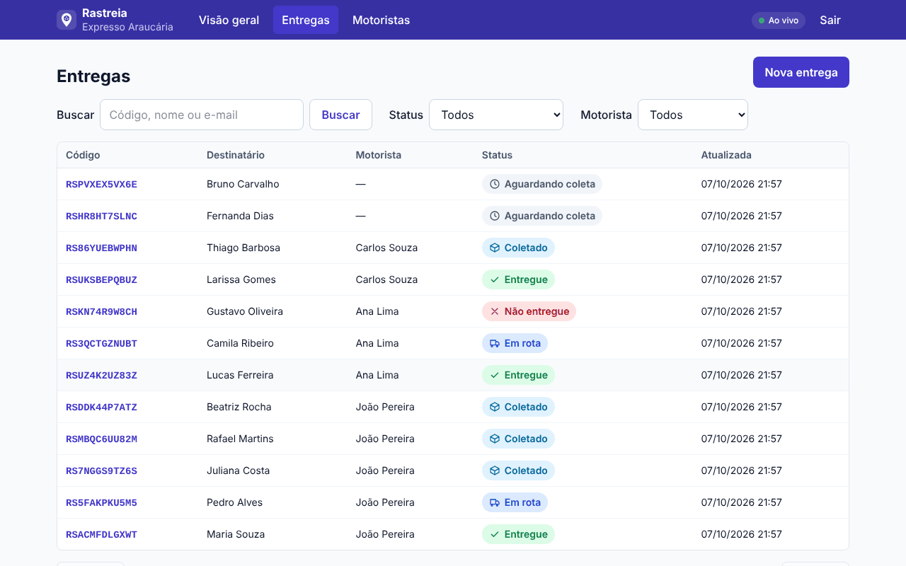
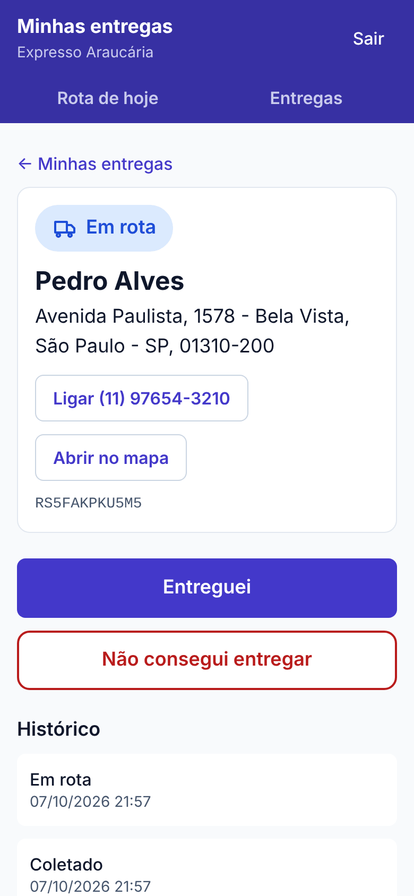
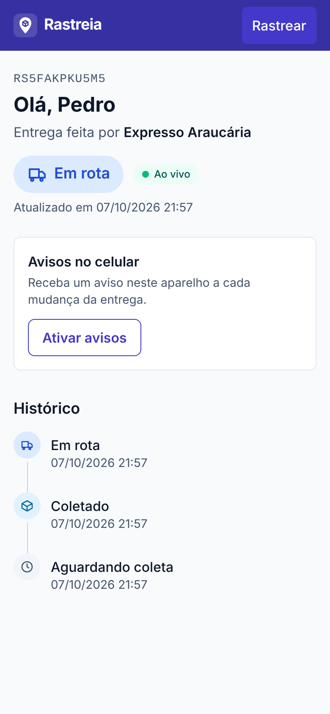
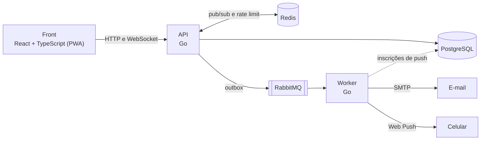

# Rastreia

[](https://github.com/Victor-Novakoski/rastreia/actions/workflows/ci.yml)
[](LICENSE)

Rastreio de entregas para transportadoras pequenas. A transportadora cadastra as entregas e imprime as etiquetas, o motorista monta a rota do dia bipando os pacotes e atualiza o status pelo celular, e quem vai receber acompanha tudo ao vivo por um link, sem criar conta.

Feito em Go e React, com PostgreSQL, Redis e RabbitMQ. Roda inteiro na máquina com `docker compose up`; o deploy é a próxima etapa.



| App do motorista | Rastreio público | Etiqueta |
| --- | --- | --- |
|  |  |  |

## O que dá para fazer

**Transportadora** (painel, no computador)
- Cria a conta sozinha, com CNPJ opcional (aceita o CNPJ novo, com letras).
- Cadastra os motoristas, que entram com a conta criada por ela.
- Cria entregas com o endereço pelo CEP e um pino no mapa que dá para arrastar.
- Imprime a etiqueta de 10 x 15 cm com o QR-code do rastreio.
- Acompanha tudo numa lista que se atualiza sozinha, com busca (sem diferenciar acentos) e filtros por status e por motorista, e vê os números dos últimos 30 dias.

**Motorista** (app web no celular)
- Bipa as etiquetas com a câmera, ou digita o código, para montar a rota do dia. Pacote sem motorista passa a ser dele.
- Vê as paradas numeradas no mapa, pede a ordem mais curta a partir de onde está e arrasta para mudar o que quiser.
- Muda o status com um toque, em botões grandes. Com sinal ruim, tocar de novo não vira erro.

**Quem recebe** (link público, sem conta)
- Vê o status e o histórico mudarem na hora, com o nome da transportadora.
- Recebe um e-mail a cada mudança e, se quiser, um aviso no celular (Web Push).
- A página não mostra dado pessoal além do primeiro nome, e o link expira 30 dias depois de a entrega terminar.

## Destaques técnicos

- **Várias transportadoras no mesmo banco.** O `carrier_id` vem do token, nunca do corpo da requisição, e o que é de outra transportadora responde 404. O isolamento tem testes de IDOR pela API, com Postgres de verdade.
- **Notificação que não se perde.** A troca de status e o "falta avisar" são gravados na mesma transação (outbox). Um relay publica no RabbitMQ com confirmação, e um worker separado manda o e-mail e o Web Push, com nova tentativa a cada 30 s e fila de falhas.
- **Tempo real entre instâncias.** WebSocket no rastreio e no painel, com Redis pub/sub para a API rodar em mais de uma instância. O painel recebe só o id e o status, sem dado pessoal.
- **Rota sem serviço pago.** Vizinho mais próximo + 2-opt em Go, em linha reta: para 30 a 50 paradas, fica perto do ótimo em microssegundos.
- **Sessão.** Access token de 15 min só em memória e refresh token opaco e rotativo em cookie `HttpOnly`. Reusar um token já trocado derruba a sessão inteira, e uma trava entre abas evita duas renovações ao mesmo tempo.
- **Defesas contra abuso.** Rate limit por IP e bloqueio progressivo de login no Redis, o mesmo tempo de resposta para e-mail que não existe, CSP gerada no build, `Origin` conferido nas rotas de sessão e corpo JSON que recusa campos desconhecidos. Os 27 riscos e como cada um é tratado estão em [SECURITY.md](docs/SECURITY.md).
- **Nada duplicado.** `Idempotency-Key` na criação de entregas e concorrência otimista na troca de status: de dois eventos ao mesmo tempo, um vale e o outro recebe 409.
- **LGPD.** O rastreio mostra o mínimo, o link expira e os dados do destinatário são anonimizados 90 dias depois de a entrega terminar.
- **Qualidade.** Testes de integração com Postgres, Redis e RabbitMQ reais (testcontainers), a especificação OpenAPI conferida contra as rotas num teste e CI com golangci-lint, govulncheck, gitleaks, Trivy e npm audit em todo PR.

## Arquitetura



Dois binários Go saem da mesma imagem Docker: a API, que também aplica as migrations, publica o outbox e roda a retenção de dados, e o worker de notificações. Redis e RabbitMQ são opcionais na API: sem eles, o tempo real e os limites ficam em memória e as notificações esperam no banco. Os detalhes estão em [ARCHITECTURE.md](docs/ARCHITECTURE.md).

## Stack

- **API:** Go 1.26, chi, pgx + sqlc, golang-migrate, Viper, JWT (golang-jwt), WebSocket (coder/websocket), go-mail e webpush-go
- **Front:** React 19, TypeScript, Vite, Tailwind CSS, React Router e TanStack Query; mapas com Leaflet e OpenStreetMap, CEP pelo ViaCEP, posição no mapa pelo Nominatim e QR-code com qrcode e jsQR
- **Dados e mensageria:** PostgreSQL 17, Redis 8 e RabbitMQ 4
- **Testes:** testing, testify e testcontainers no Go; Vitest e Testing Library no front
- **Infra e CI:** Docker (imagem final distroless, sem root), Docker Compose e GitHub Actions

## Como rodar

Precisa só de Docker.

```bash
docker compose up --build
```

| O quê | Onde |
| --- | --- |
| Front | http://localhost:5173 |
| API | http://localhost:8080 (especificação em `/openapi.yaml`) |
| E-mails enviados (Mailpit) | http://localhost:8025 |
| Painel do RabbitMQ | http://localhost:15672 (guest/guest) |

A API cria uma conta de demonstração, a "Transportadora Demo", que começa vazia. Qualquer pessoa também pode criar a própria transportadora pela página inicial.

| E-mail | Senha |
| --- | --- |
| admin@rastreia.dev | admin12345 |

Em desenvolvimento, a API e o worker rodam com [air](https://github.com/air-verse/air) e o front com o Vite: salvar um arquivo recompila e recarrega sozinho. Essa configuração fica em `docker-compose.override.yml`, que o Docker Compose carrega automaticamente. Se a porta 5432 já estiver ocupada por um Postgres instalado na máquina, suba com `DB_PORT=5433 docker compose up --build` (`REDIS_PORT` e `RABBITMQ_PORT` fazem o mesmo para as outras portas).

<details>
<summary>Aviso no celular (Web Push)</summary>

O aviso precisa de um par de chaves VAPID. Para gerar, com Go 1.26 instalado:

```bash
go run ./cmd/worker vapid
```

Ponha as duas linhas no arquivo `.env` da raiz do projeto (crie o arquivo se ele não existir) e suba de novo com `docker compose up`. Em `http://localhost:5173/rastreio/<código>` aparece o botão "Ativar avisos", que já dá para testar no navegador do computador. No celular o navegador exige HTTPS, então só depois do deploy; no iPhone, o push só funciona com o site adicionado à tela de início.

</details>

<details>
<summary>Rodar a API fora do Docker</summary>

Precisa de Go 1.26 e do air (`go install github.com/air-verse/air@latest`). Suba as dependências no Docker e rode o air na raiz do projeto:

```bash
cp .env.example .env
docker compose up -d db redis rabbitmq mailpit
air              # API em http://localhost:8080, recompila a cada arquivo salvo
make run-worker  # em outro terminal: e-mails e Web Push
```

O front fica em `web/` e usa Node 22:

```bash
cd web
npm ci
npm run dev      # http://localhost:5173
```

Se o `docker compose up` completo estiver rodando, pare antes os serviços `api`, `worker` e `web`, que usam as mesmas portas.

</details>

## Roteiro de 5 minutos

1. Abra http://localhost:5173, clique em "Entrar" e use a conta demo.
2. Em "Motoristas", cadastre um motorista.
3. Em "Entregas", clique em "Nova entrega": o CEP preenche rua, bairro e cidade, e o pino no mapa dá para arrastar. Escolha o motorista e clique em "Criar entrega".
4. Na entrega criada, abra "imprimir etiqueta" para ver o QR-code e "ver rastreio público" numa aba ao lado.
5. Numa janela anônima, entre como o motorista em "Sou motorista".
6. Em "Rota de hoje", digite o código da entrega (ou bipe a etiqueta com a câmera) e toque em "Organizar melhor rota".
7. Abra a entrega e toque em "Confirmar coleta" e depois em "Saí para entrega". A aba do rastreio muda sozinha, e cada mudança gera um e-mail no Mailpit.

## Testes

Precisa de Go 1.26 e Docker: os testes de integração sobem containers temporários.

```bash
make test        # unitários + integração com Postgres, Redis e RabbitMQ reais
make test-short  # só os unitários, sem Docker
make lint        # golangci-lint, na mesma versão da CI
```

No front, com Node 22:

```bash
cd web
npm ci
npm test                          # Vitest e Testing Library
npm run lint && npm run typecheck
```

A CI roda tudo isso em todo PR, mais o sqlc em dia, govulncheck, gitleaks, o build da imagem com a varredura do Trivy, o build do front, o npm audit e o título do PR em Conventional Commits.

## API

A especificação completa está em [`api/openapi.yaml`](api/openapi.yaml) (OpenAPI 3), também servida em `GET /openapi.yaml`. Um teste falha se uma rota servida não estiver documentada.

Um passeio pela API com curl (precisa do curl 7.82 ou mais novo, pelo `--json`, e do jq):

```bash
API=http://localhost:8080

# entra com a conta demo
TOKEN=$(curl -s $API/auth/login --json '{"email":"admin@rastreia.dev","password":"admin12345"}' | jq -r .token)

# cadastra um motorista
DRIVER_ID=$(curl -s $API/drivers -H "Authorization: Bearer $TOKEN" \
  --json '{"name":"João Pereira","email":"joao@rastreia.dev","password":"motorista1"}' | jq -r .id)

# cria uma entrega para ele (a chave evita criar a mesma entrega duas vezes se a requisição for repetida)
ENTREGA=$(curl -s $API/deliveries -H "Authorization: Bearer $TOKEN" -H "Idempotency-Key: pedido-123" --json '{
  "recipient_name": "Maria Souza", "recipient_email": "maria@example.com", "recipient_phone": "11987654321",
  "postal_code": "01001-000", "street": "Praça da Sé", "number": "10", "district": "Sé",
  "city": "São Paulo", "state": "SP", "driver_id": '"$DRIVER_ID"'}')
ID=$(echo "$ENTREGA" | jq -r .id)
CODIGO=$(echo "$ENTREGA" | jq -r .tracking_code)

# o motorista entra, vê as entregas dele e muda o status
DRIVER=$(curl -s $API/auth/login --json '{"email":"joao@rastreia.dev","password":"motorista1"}' | jq -r .token)
curl -s $API/me/deliveries -H "Authorization: Bearer $DRIVER"
curl -s $API/deliveries/$ID/events -H "Authorization: Bearer $DRIVER" --json '{"status":"picked_up"}'

# quem recebe acompanha pelo código de rastreio, sem login
curl -s $API/public/tracking/$CODIGO
```

<details>
<summary>Todas as rotas</summary>

| Método | Rota | Quem usa |
| --- | --- | --- |
| GET | `/health` | público: confere o banco e o Redis |
| GET | `/openapi.yaml` | público: a especificação da API |
| POST | `/auth/signup` | público: cadastro da transportadora, que já entra logada |
| POST | `/auth/login` | transportadora e motorista |
| POST | `/auth/refresh`, `/auth/logout` | transportadora e motorista (cookie da sessão) |
| GET | `/me` | transportadora e motorista: o usuário e a transportadora |
| GET | `/summary` | transportadora: os números do painel |
| GET, POST | `/drivers` | transportadora |
| GET, POST | `/deliveries` | transportadora; a lista aceita `status`, `driver`, `q` (busca), `page` e `size` |
| GET | `/deliveries/{id}` | transportadora e o motorista da entrega |
| PATCH | `/deliveries/{id}` | transportadora |
| GET, POST | `/deliveries/{id}/events` | transportadora e o motorista da entrega |
| GET | `/me/deliveries` | motorista: as entregas dele, as em aberto primeiro |
| GET | `/me/route` | motorista: a rota de hoje, com as paradas |
| POST | `/me/route/deliveries` | motorista: bipar um pacote (código ou link do QR-code) |
| DELETE | `/me/route/deliveries/{id}` | motorista: tirar um pacote da rota |
| PUT | `/me/route/order` | motorista: salvar a ordem escolhida |
| POST | `/me/route/optimize` | motorista: ordem sugerida (vizinho mais próximo + 2-opt) |
| GET | `/public/tracking/{code}` | público, 30 consultas por minuto por IP |
| GET | `/public/tracking/{code}/live` | público: WebSocket com cada mudança |
| GET | `/public/push/key` | público: a chave VAPID (só com o Web Push ligado) |
| POST, DELETE | `/public/tracking/{code}/push` | público: liga e desliga o aviso neste navegador |
| GET | `/live/deliveries` | transportadora: WebSocket do painel (token na primeira mensagem) |

Cada transportadora só enxerga os próprios motoristas e entregas, e cada motorista só as entregas dele; o resto responde 404.

</details>

## Estrutura

```
cmd/
  api/                ponto de entrada da API
  worker/             worker de notificações; `worker vapid` gera as chaves do Web Push
api/                  especificação OpenAPI (servida em /openapi.yaml)
internal/
  server/             rotas, middlewares, log de requisições e rate limit
  auth/               JWT, refresh token, senhas, login e papéis
  user/               cadastro da transportadora, motoristas e /me
  delivery/           entregas, endereço, eventos de status, busca, rastreio público e WebSockets
  route/              rota do dia do motorista: bipar, agrupar paradas e ordenar (2-opt)
  realtime/           WebSocket e pub/sub, em memória ou pelo Redis
  notify/             relay do outbox, worker, e-mail e Web Push
  push/               inscrição do navegador no Web Push
  retention/          anonimização dos dados do destinatário (LGPD)
  config/             variáveis de ambiente (Viper)
  database/           conexão, migrations e queries SQL
  store/              código gerado pelo sqlc
  httpx/, apperr/     helpers de HTTP e erros de domínio
  testdb/, testredis/ Postgres e Redis temporários para os testes de integração
web/                  front: página inicial, painel, app do motorista e rastreio público
docs/                 produto, arquitetura, segurança, design, regras, tarefas e decisões
```

## Decisões

- **sqlc em vez de ORM:** o SQL é escrito à mão e revisável, e o Go é gerado com tipos; erro de SQL aparece ao gerar, não em produção.
- **Status muda só por evento:** cada mudança vira uma linha em `delivery_events`, que é o histórico do rastreio e o outbox das notificações.
- **Outbox em vez de publicar depois do commit:** se a API cair ou o RabbitMQ estiver fora, o aviso continua gravado e sai quando der.
- **Redis opcional:** com ele, o tempo real e os limites valem para todas as instâncias; sem ele, a API roda sozinha com tudo em memória.
- **Rota sem serviço pago:** uma heurística em Go no lugar do Google, do Mapbox ou de um servidor OSRM para manter.
- **Código de rastreio sem 0/O e 1/I:** fácil de ditar por telefone e impossível de adivinhar a partir de outro código.

O registro completo, com as alternativas descartadas, está em [DECISIONS.md](docs/DECISIONS.md).

## Documentação

| Documento | Conteúdo |
| --- | --- |
| [PRD](docs/PRD.md) | O que o produto é, os requisitos e o que está fora de escopo |
| [Arquitetura](docs/ARCHITECTURE.md) | Peças, camadas, pastas, fluxos e banco de dados |
| [Segurança](docs/SECURITY.md) | Como cada risco é tratado e o que falta |
| [Design](docs/DESIGN.md) | Convenções da API e das interfaces |
| [Regras](docs/RULES.md) | Regras de código, testes, git e definição de pronto |
| [Tarefas](docs/TASKS.md) | Backlog por etapa |
| [Decisões](docs/DECISIONS.md) | Decisões tomadas, o porquê de cada uma e armadilhas conhecidas |
| [OpenAPI](api/openapi.yaml) | Rotas, corpos e respostas da API |

## Próximos passos

O deploy: front estático, API e worker em containers atrás de HTTPS, banco sem acesso de fora e segredos fora de arquivo. O que falta está em [TASKS.md](docs/TASKS.md).

## Licença

[MIT](LICENSE). Feito por [Victor Novakoski](https://github.com/Victor-Novakoski).
